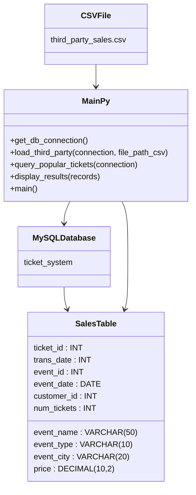

# event-ticket-pipeline

This project loads third-party ticket sales data from a CSV file into a MySQL database and displays the most popular tickets from the past month.

## Prerequisites

- Python 3
- MySQL Server
- MySQL Workbench
- A MySQL database named `ticket_system`
- A table named `sales`

## Setup

### 1. Install dependency

```bash
pip3 install -r requirements.txt
```

## UML Diagram


